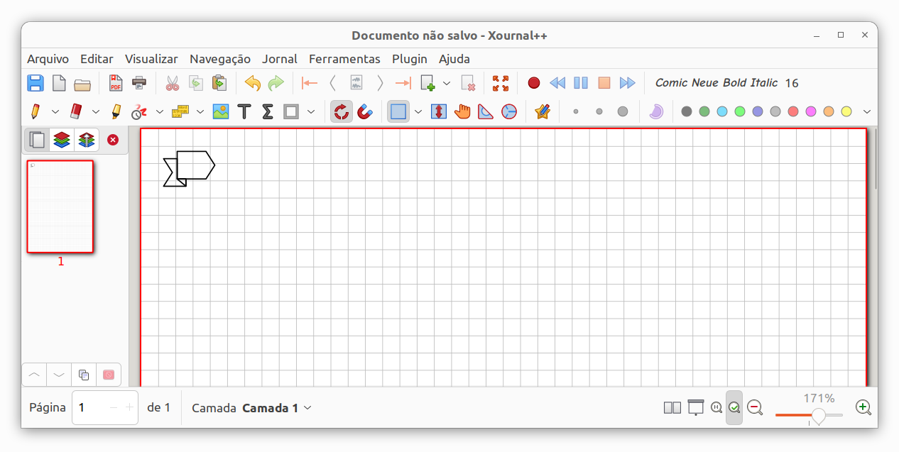
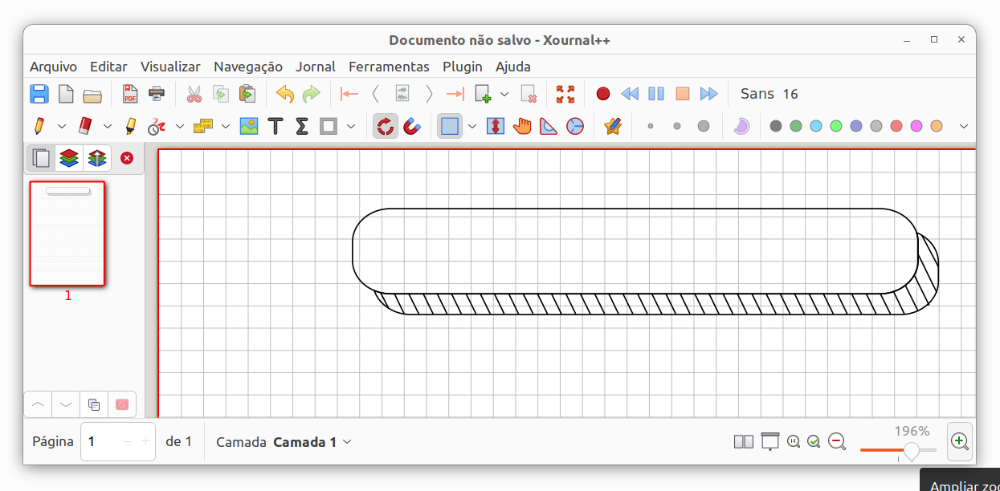

# Xournal Plugin BulletJournalGraphs

## Introduction
[Xournalpp](https://github.com/xournalpp/xournalpp) plugin to make bullet journal graphics.

  * **BulletJournalGraphs** The plugin directory.
  * **makedeb** This directory contains the script to generate the `xournalpp-plugin-bulletjournalgraphs.deb` binary file.

## Manual Install

To install the plugin, follow any of these methods:

  * Copy the directory `BulletJournalGraphs` into the path `/usr/share/xournalpp/plugins/`, or
  * Create the `xournalpp-plugin-bulletjournalgraphs.deb` binary file by executing the script in the `makedeb` directory, following these commands:

        cd makedeb
        ./makedeb.sh

## Usage

### Arrow Bullet `<Ctrl><Alt>a`

### Title Round `<Ctrl><Alt>r`

